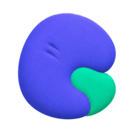
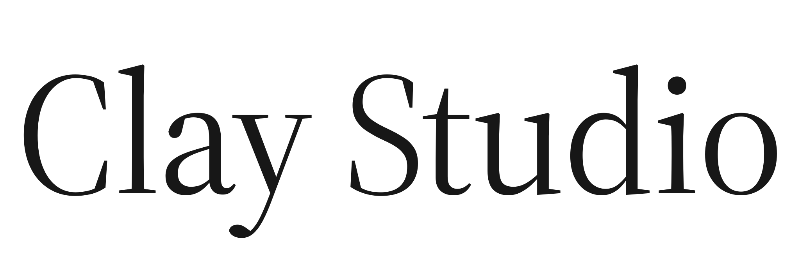

<p align="center">
  <br>
  
</p>

<h2 align="center">Where minds work together.</h2>

<p align="center">
  A self-hosted workspace where people and coding agents work together<br>
  across projects, sessions, and providers.
</p>

<p align="center">
  <a href="https://www.npmjs.com/package/clay-server"></a>
  <a href="https://www.npmjs.com/package/clay-server"></a>
  <a href="https://github.com/chadbyte/clay"></a>
  <a href="https://github.com/chadbyte/clay/blob/main/LICENSE"></a>
</p>

Clay Studio turns local coding agents into a shared, persistent team. Run different agents from one browser workspace, join a teammate's live session, keep project knowledge between conversations, and automate work without handing your workspace to another cloud.

## Quick start

**Requirements:** Node.js 20+ and at least one supported coding-agent CLI installed and authenticated.

```bash
npx clay-server
# Open the URL or scan the QR code from another device
```

Clay Studio runs on your machine and serves the workspace to your browser. For access outside your local network, use a private network such as Tailscale.

## Why Clay Studio

### Work together

Projects, sessions, people, and agents share one workspace. Teammates can see live activity, enter the same session, hand off work, and respond to permission requests without gathering around one terminal.

### Keep the context

Sessions do not have to be disposable chats. Mates retain their roles and knowledge, project instructions carry across supported runtimes, and decisions remain available when the next task begins.

### Stay in control

The daemon runs on infrastructure you control. Sessions and knowledge live on disk in portable JSONL and Markdown rather than a proprietary database. Change coding agents without migrating the workspace around them.

## Supported coding agents

Clay Studio currently includes integrations for:

**Claude Code · Codex · Grok Build · Kimi Code · GitHub Copilot CLI · Qwen Code · Junie CLI · Antigravity CLI · OpenCode · Kiro CLI**

Clay detects locally installed runtimes and exposes the ones available on your machine. Each runtime keeps its own authentication and may expose different models, modes, and capabilities.

## Core capabilities

- **Shared projects and live sessions.** Organize several repositories in one sidebar, run sessions in parallel, and collaborate with presence, cursors, mentions, and handoffs.
- **Persistent Mates.** Create AI collaborators with their own identity, instructions, knowledge, memory, direct messages, and roles in structured debates.
- **Cross-provider continuity.** YOKE gives supported coding agents a common session interface and carries project instruction files across vendor boundaries.
- **Parallel and background work.** Use git worktrees, paired sessions, spawned workers, scheduled tasks, and Ralph Loops without losing visibility into what is running.
- **A workspace on every device.** Use the desktop browser or install the PWA on mobile. Receive push notifications for approvals, failures, and completed work.
- **Tools where the work happens.** Browse and edit files, inspect diffs and history, open terminals, install skills, connect MCP servers, and manage project knowledge from the same workspace.

## Your machine is the server

The normal request path is:

```text
Browser → Clay Studio daemon → selected coding-agent runtime → model provider
```

Clay Studio does not relay project traffic through a Clay-hosted cloud. Your code leaves the machine only when the selected runtime sends it to its model provider, just as it would when you use that CLI directly.

The `d.clay.studio` hostname used for local HTTPS is a DNS-only service: no application data passes through it. See [clay-dns](clay-dns/) for the implementation and threat model.

## Common CLI commands

```bash
npx clay-server              # Start on the default port (2633)
npx clay-server -p 8080      # Use a different port
npx clay-server --add .      # Add the current directory
npx clay-server --list       # List registered projects
npx clay-server --shutdown   # Stop the daemon
```

Run `npx clay-server --help` for the complete command reference.

## Documentation

- [Documentation index](docs/README.md)
- [Architecture](docs/guides/architecture.md)
- [MCP integration](docs/guides/MCP-IMPLEMENTATION.md)
- [Contributing](CONTRIBUTING.md)
- [Changelog](CHANGELOG.md)

## Community

The community-built [Clay Stream Deck plugin](https://github.com/egns-ai/clay-streamdeck-plugin) turns physical buttons into a live dashboard for sessions, worktrees, and permission requests.

Building something with Clay Studio? Share it in [GitHub Discussions](https://github.com/chadbyte/clay/discussions).

## Disclaimer

Clay Studio is not affiliated with the providers of the coding agents it supports. Product names and trademarks belong to their respective owners. The software is provided "as is," and users are responsible for complying with the terms of their selected providers.

## License

[MIT](LICENSE)
